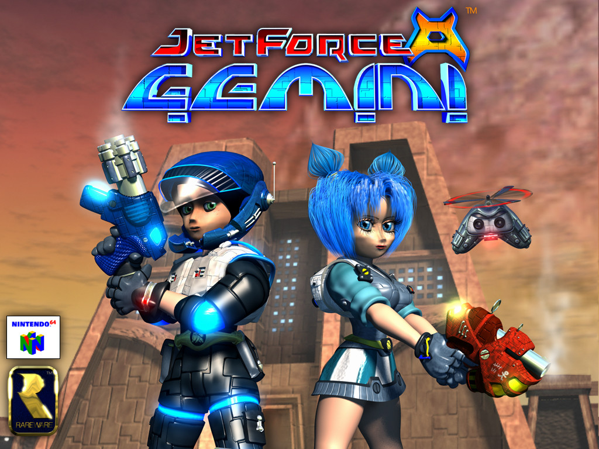

# JetForceGeminiApp

Conceitos do flutter aplicados em um projeto de aplicativo que detalha informações do jogo Jet Force Gemini de 1999.

## Dupla: Mariana Santiago Matos & Nickolas Garcia Franco Avelino Lopes

ETEC Professor Basilides de Godoy - Ensino Médio com Habilitação Profissional Técnico em Programação de Jogos Digitais. 3ºA de 2024

# Wikis
## Descrição do Projeto
- [Descrição, Objetivo e Funcionalidade](https://github.com/MariSantiago0/JetForceGeminiApp/wiki/Descri%C3%A7%C3%A3o,-Objetivo-e-Funcionalidade)
## Widgets 
- [Aplicação e Funcionalidades do Flutter](https://github.com/MariSantiago0/JetForceGeminiApp/wiki/Aplica%C3%A7%C3%A3o-e-Funcionalidades-do-Flutter)
## Protótipo
- [Mapa de Navegação & Implementações do Flutter](https://github.com/MariSantiago0/JetForceGeminiApp/wiki/Mapa-de-Navega%C3%A7%C3%A3o-&-Aplica%C3%A7%C3%B5es-do-Flutter)

